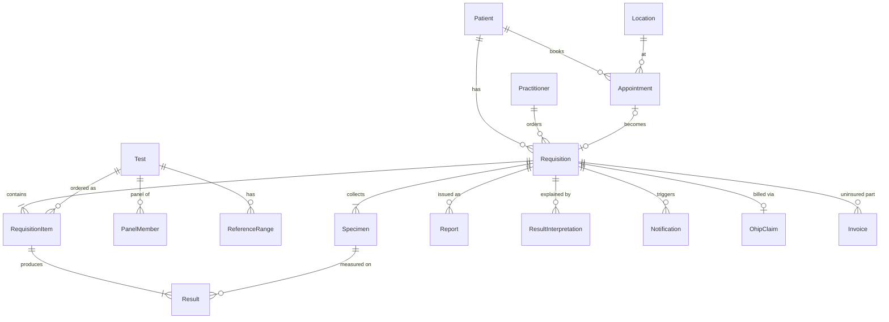

# LabFlow data model

LabFlow is a portfolio lab information system for an Ontario community lab: online booking,
reception, specimen collection, resulting, reports, email notifications and an AI-assisted
interpretation that a clinician reviews before the patient sees it.

It replaces the Iranian legacy `Laboratory` database. Only the clinical knowledge is carried over
(test catalog, panels, reference ranges); insurance tariffs, SEPAS integration and Jalali dates are not.

## Workflow → tables

| Step | Tables | FHIR resource |
|---|---|---|
| Book an appointment | `sched.Appointment`, `sched.LocationHours`, `sched.LocationClosure` | Appointment |
| Reception (requisition entered) | `lab.Requisition`, `lab.RequisitionItem`, `lab.RequisitionCopyTo` | ServiceRequest |
| Collection | `lab.Specimen` | Specimen |
| Resulting and verification | `lab.Result` (temporal) | Observation |
| Report | `lab.Report` (versioned; PDF in Blob Storage) | DiagnosticReport |
| AI interpretation | `lab.ResultInterpretation` | — |
| Email / SMS | `notify.Notification` (outbox) | Communication |
| Billing | `billing.OhipClaim`, `billing.OhipClaimItem`, `billing.Invoice` | Claim, Invoice |
| Who saw what | `audit.AccessLog` (append-only) | AuditEvent |

## Design decisions

- **Ontario identifiers.** Health card number (10 digits, Luhn check digit checked in the app), version
  code and expiry; practitioners carry a CPSO/CNO licence and a 6-digit OHIP billing number.
  Postal codes are checked against the `A1A 1A1` pattern.
- **SI units and LOINC.** Every numeric test has a UCUM unit (`mmol/L`, `µmol/L`, `×10⁹/L` ...) and,
  where one exists, a LOINC code from the pCLOCD subset that OLIS uses.
- **Ranges are copied onto results.** `lab.Result` stores `RefLow/RefHigh/RefText` at resulting time,
  so editing `ref.ReferenceRange` never changes a released report. `ref.fn_ReferenceRangeFor` picks the
  most specific range (pregnancy > sex > narrowest age band); `lab.fn_AbnormalFlag` returns the
  HL7 0078 flag (`N/L/H/LL/HH`). Both are used by the demo seed and can be used by the app.
- **Corrections keep history.** `core.Patient` and `lab.Result` are system-versioned temporal tables
  (history in the `history` schema). An amended result creates a new `lab.Report` version.
- **AI output is gated.** `lab.ResultInterpretation` must have a reviewer before it can be
  `Approved` (check constraint). It stores model, prompt version and token counts for traceability.
  It is decision support, not a diagnosis.
- **Outbox for email.** The app writes a `notify.Notification` row in the same transaction as the
  change; an Azure Function sends queued rows and retries with `NextAttemptAt`. Messages contain a
  portal link, never results.
- **PHIPA.** `audit.AccessLog` records views as well as changes, keyed by `PatientId` so a patient's
  access report is one query. A trigger blocks updates and deletes.
- **No passwords in the database.** `sec.AppUser` maps an external identity (ASP.NET Core Identity or
  Entra ID) to one role.
- **Types.** UTC `datetime2` everywhere, `decimal` money, `nvarchar` text (English + French),
  `rowversion` for optimistic concurrency.

## Legacy migration

`etl.LegacyTestMap` is the worksheet for mapping `Laboratory.dbo.AzDefine` (1,430 tests) to
`ref.Test`: target test, a conversion factor from conventional to SI units, and a review status.
Only `Reviewed` rows are migrated. Conversion factors are analyte-specific, for example:

| Analyte | Legacy | SI | Factor |
|---|---|---|---|
| Glucose | mg/dL | mmol/L | 0.0555 |
| Creatinine | mg/dL | µmol/L | 88.4 |
| Cholesterol (total, HDL, LDL) | mg/dL | mmol/L | 0.02586 |
| Triglycerides | mg/dL | mmol/L | 0.01129 |
| Hemoglobin | g/dL | g/L | 10 |

## Not yet decided / to verify

- OHIP lab fee codes (`ref.Test.OhipFeeCode`) must come from the current Schedule of Benefits.
- Reference ranges in the seed are typical adult values for demonstration only.
- Whether uninsured lab tests attract HST.
